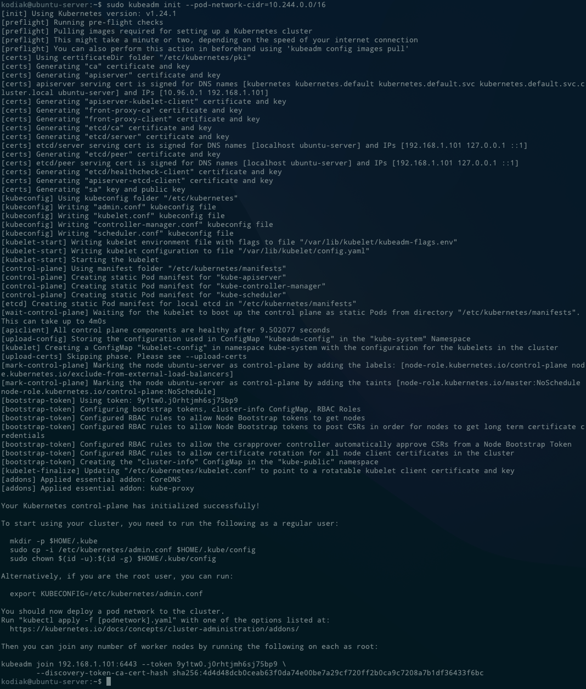

# Install Kubernate Master (Control-plane) ( only master machine )

1. Initial kubeadm
    
    ```bash
    sudo kubeadm init --pod-network-cidr=10.244.0.0/16
    ```
    
    If you get this error when you run kubeadm, You must remove config.toml and restart containerd
    
    > [init] Using Kubernetes version: v1.24.1
    [preflight] Running pre-flight checks
    error execution phase preflight: [preflight] Some fatal errors occurred:
    [ERROR CRI]: container runtime is not running: output: E0531 05:37:53.103585   11384 remote_runtime.go:925] "Status from runtime service failed" err="rpc error: code = Unimplemented desc = unknown service runtime.v1alpha2.RuntimeService"
    time="2022-05-31T05:37:53Z" level=fatal msg="getting status of runtime: rpc error: code = Unimplemented desc = unknown service runtime.v1alpha2.RuntimeService"
    , error: exit status 1
    [preflight] If you know what you are doing, you can make a check non-fatal with `--ignore-preflight-errors=...`
    To see the stack trace of this error execute with --v=5 or higher
    > 
    
    ```bash
    sudo rm /etc/containerd/config.toml
    ```
    
    ```bash
    sudo systemctl restart containerd
    ```
    

2. You will get following command
    
    
    
    ```bash
    mkdir -p $HOME/.kube
    sudo cp -i /etc/kubernetes/admin.conf $HOME/.kube/config
    sudo chown $(id -u):$(id -g) $HOME/.kube/config
    ```
    
3. Copy kubeadm join command (Don't missing this command)

4. Install kube-flannel
    
    ```bash
    kubectl apply -f [https://raw.githubusercontent.com/coreos/flannel/master/Documentation/kube-flannel.ym](https://raw.githubusercontent.com/coreos/flannel/master/Documentation/kube-flannel.yml)
    ```
    
5. Test get nodes
    
    ```bash
    kubectl get nodes
    ```
